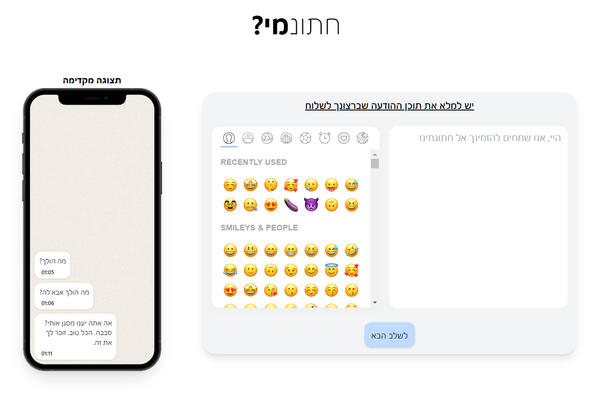
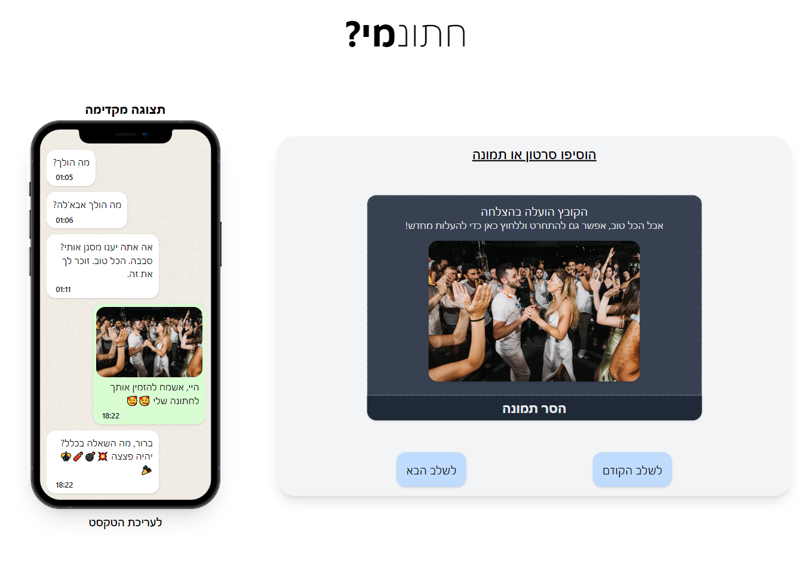
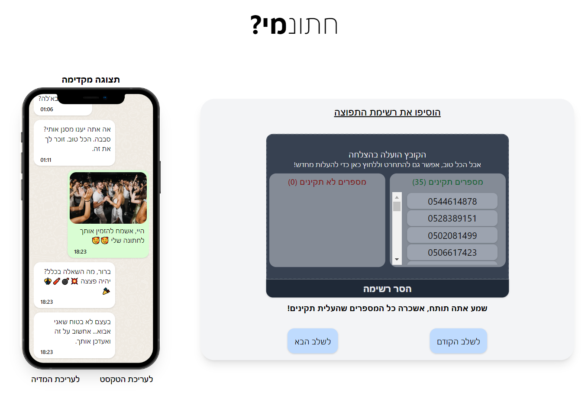
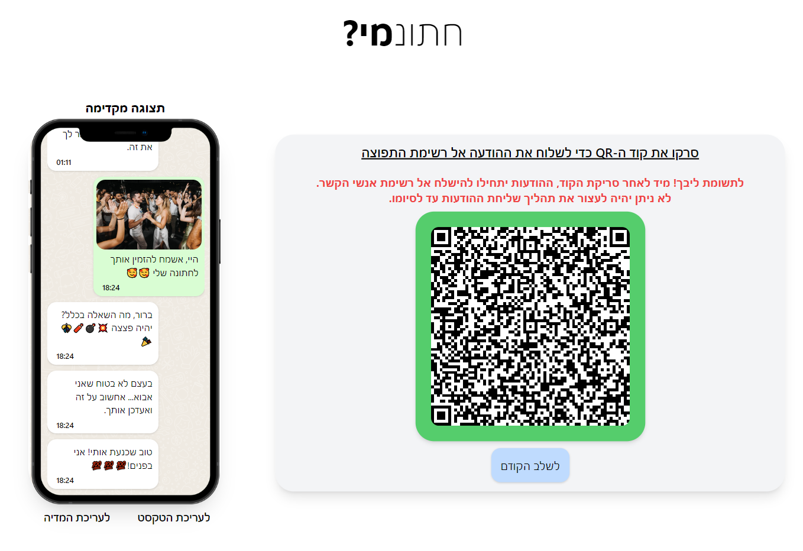

# Hatuna'Mi
Hatuna'Mi is a web application that helps users to send multiple guests invitations for their wedding. It offers an instant visual of what their message would look like if they sent it, on a model right next to the text box. It also offers an easy access to the personal WhatsApp account using a QR code.

Features:  
Send multiple guests invitations at once  
Instant visual of the invitation before sending it  
Easy access to the personal WhatsApp account using a QR code  

Benefits:  
Saves time and effort  
Makes it easy to create and send personalized invitations  
Convenient for guests to RSVP  

Your guests will receive an email with a link to view the invitation. They can then RSVP by clicking on the link and entering their name and email address.
